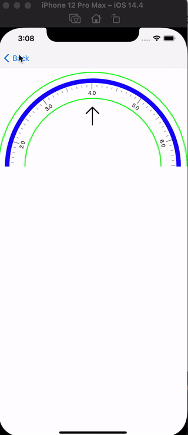

# RulerKit

[](https://travis-ci.org/1334858022@qq.com/RulerKit)
[](https://cocoapods.org/pods/RulerKit)
[](https://github.com/SYJshang/RulerKit/blob/main/README.md)
[](https://cocoapods.org/pods/RulerKit)

## Example

To run the example project, clone the repo, and run `pod install` from the Example directory first.

## Requirements

## Installation

RulerKit is available through [CocoaPods](https://cocoapods.org). To install
it, simply add the following line to your Podfile:

```ruby
pod 'RulerKit'
```
## Show



## Author

1334858022@qq.com, SYJshang

## License

RulerKit is available under the MIT license. See the LICENSE file for more info.
